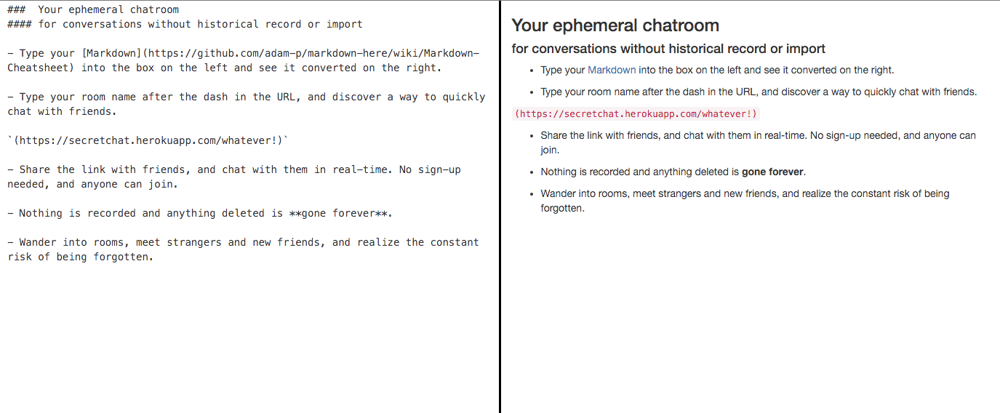

    

      <h3>Ozymandias Chatroom</h3>

      

    

      

        

        
A chatroom generator built in Express and Node. Users can create personal and private rooms, share the link with friends and comrades, and have a portable chat up and running in seconds. Markdown is converted to text, and any message can be permanently erased. Visit the chatroom <a class='link' href='https://secretchat.herokuapp.com'>here</a>, and read about the project and contribute on <a class='link' href='https://github.com/janaipakos/Ozymandias-Chatroom'>GitHub</a>.

        

      

    

      

      

        

      

  

