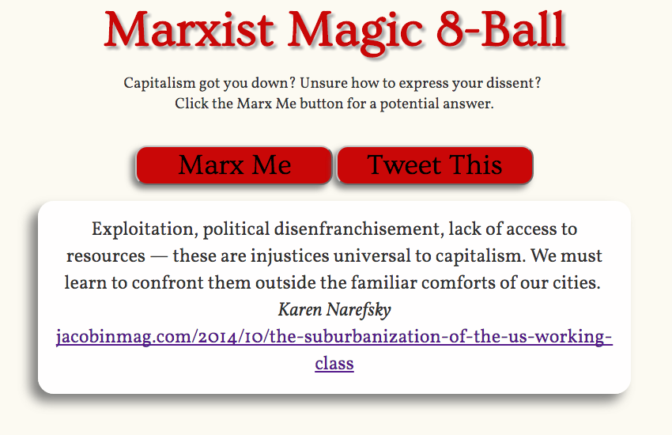
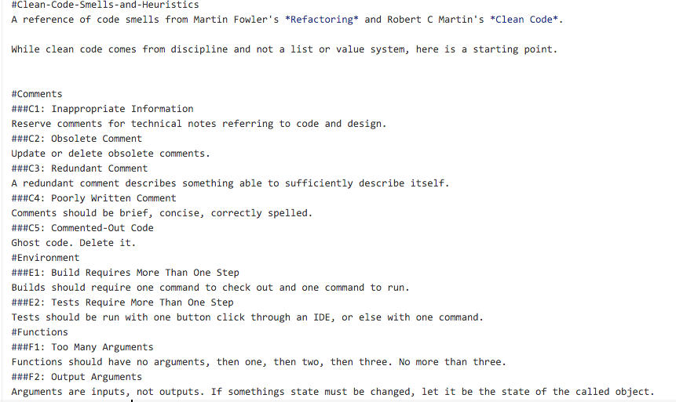

    

        <h1>Projects</h1>
        

        

            

                

                    
Below is a portfolio of projects that I have worked on independently or collaboratively in the fields of web development, writing and editing, UX/UI, and video editing.

                

            

        

        

            

                

                    

                        <a class="portfolio" href='/quantflaunt'><h2>QuantFlaunt</h2></a>
                        
QuantFlaunt is a satirical web application that explores the future of online branding and data quantification. 

                    

                

                

                    

                        <h2>D3.js User Interface</h2>
                        
                        
At Capco Digital, I helped build D3.js dashboard visualizations displaying the relationships between departments .

                    

                

                

                    

                        <a class="portfolio" href='http://csalateral.org/issue3/ecologies/boluk'><h2>Scrypt</h2></a>
                        
In the Spring of 2014, my classmates and I brainstormed, designed, and mass-produced an alternative currency slash art object 

                    

                

                

                    

                        

                            <a class="portfolio"  href='http://sched.co/2AhK'><h2>IndieCade East</h2></a>
                            
In February of 2015, I gave a presentation titled "Software and Hardware in Post-Communist Central and Eastern Europe" at the electronics and video game conference IndieCade East in New York City.

                        

                    

                    

                        

                            <a class="portfolio"  title="Letters YouTube" href='https://www.youtube.com/watch?v=AOa1aX8Ehek'><h2>Clinton Hill</h2></a>
                            
I'm interested in people and narratives, and enjoy telling digital stories. Here is a video of my Grandmother's emails with shots of Clinton Hill, Brooklyn.

                        

                    

                    

                        

                            <a class="portfolio"  href="https://www.youtube.com/watch?v=u0J6l82ipT0" title="Fiction YouTube" ><h2>Future</h2></a>
                            
I love movies and editing video essays. This is a short clip on women and advertising in video games.

                        

                    

                

                

                

                    

                        <a class="portfolio"  href='https://github.com/janaipakos/Marx-Magic-8-Bball'><h2>Marxist Magic 8-Ball</h2></a>
                        
Collection of tweetable quotes from <a href="https:jacobinmag.com" class="link"><em>Jacobin</em></a> magazine.

                    

                

                

                    

                        <a class="portfolio"  href='https://github.com/janaipakos/Ozymandias-Chatroom'><h2>Ozymandias Chatroom</h2></a>
                        
A (semi)-private chatroom where anyone can join and nothing is recorded. Built with Node.js and Express.js.

                    

                

                

                    

                        <a class="portfolio"  href='https://github.com/janaipakos/Clean-Code-Smells-and-Heuristics'><h2>Clean Code</h2></a>
                        
A reference of code smells from Martin Fowler's Refactoring and Robert C Martin's <em>Clean Code</em>.

                    

                

              

            

