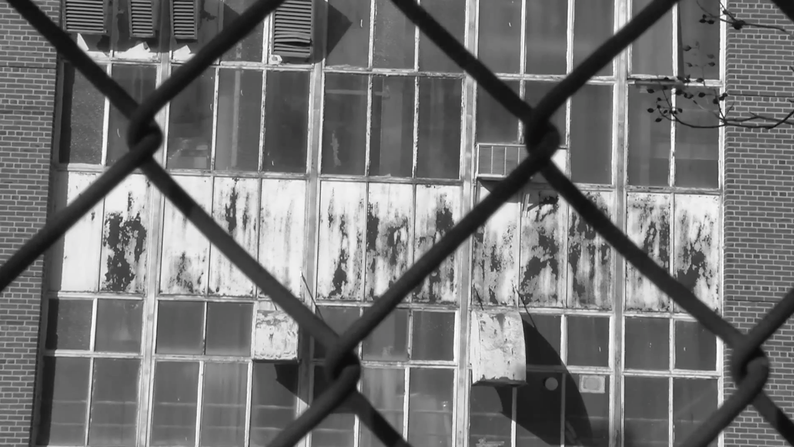
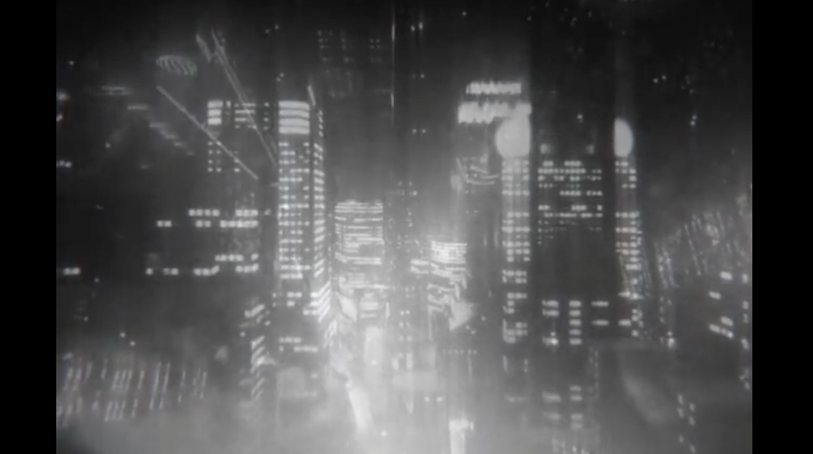

    

      <h1>WORK SAMPLES</h1>
      

      

        

          

          
Design, Technology, and UX: I'm interested in narratives across several mediums. Below is a sample of work in the fields of technology, software, video games, and cryptocurrency.

          

        

      

    

    

      

        

        <figure>
          
          <figcaption>
            <h5>QUANTFLAUNT</h5>
            <a data-toggle="modal" href="#quant" class="btn btn-default btn-lg">See More</a>
          </figcaption>
        </figure>
        

      

              

                

                  

                    

                      <button type="button" class="close" data-dismiss="modal" aria-hidden="true">&times;</button>
                      <h4 class="modal-title">QUANTFLAUNT: Web Design, Development, Branding</h4>
                    

                    

                      

                      
QuantFlaunt is a satirical web application that explores the future of online branding and data quantification. By collecting and sharing not only everyday measureables, but also intangible thoughts and experiences, QuantFlaunt gives users a self-determined number that represents their identity and provides the 'big picture.' It's the interesction between Klout and The Onion.

                      
<strong><a href="http://quantflaunt.github.io" title="QuantFlaunt" class="link">Visit Site</a></strong>

                    

                    

                      <button type="button" class="btn btn-default" data-dismiss="modal">Close</button>
                    

                  

                

              

      

        

        <figure>
          
          <figcaption>
            <h5>D3.JS DASHBOARD</h5>
            <a data-toggle="modal" href="#dashboard" class="btn btn-default btn-lg">See More</a>
          </figcaption>
        </figure>
        

      

              

                

                  

                    

                      <button type="button" class="close" data-dismiss="modal" aria-hidden="true">&times;</button>
                      <h4 class="modal-title">D3.JS DASHBOARD: Web Design, Development</h4>
                    

                    

                      

                      
At Capco Digital, I helped build D3.js dashboard visualizations displaying the relationships between departments and the status of projects for a national bank and a national mortgage lender.

                      
<strong><a href="http://www.capco.com/services/digital" title="Capco Digital" class="link">Visit Site</a></strong>

                    

                    

                      <button type="button" class="btn btn-default" data-dismiss="modal">Close</button>
                    

                  

                

              

      

        

        <figure>
          
          <figcaption>
            <h5>CRYPTOCURRENCY</h5>
            <a data-toggle="modal" href="#scrypts" class="btn btn-default btn-lg">See More</a>
          </figcaption>
        </figure>
        

      

              

                

                  

                    

                      <button type="button" class="close" data-dismiss="modal" aria-hidden="true">&times;</button>
                      <h4 class="modal-title">CRYPTOCURRENCY: Design, Branding</h4>
                    

                    

                      

                      
In the Spring of 2014, my classmates and I brainstormed, designed, and mass-produced an alternative currency slash art object that focuses on collaboration and exchange. The currency is branded as Scrypt&mdash;a portmanteau of crypt and scrip. 

                      
<strong><a href="http://lateral.culturalstudiesassociation.org/issue3/ecologies/boluk/main" title="Lateral" class="link">Read More</a></strong>

                    

                    

                      <button type="button" class="btn btn-default" data-dismiss="modal">Close</button>
                    

                  

                

              

              

      

      

        

        <figure>
          
          <figcaption>
            <h5>PRESENTATIONS</h5>
            <a data-toggle="modal" href="#Pratt" class="btn btn-default btn-lg">See More</a>
          </figcaption>
        </figure>
        

      

              

                

                  

                    

                      <button type="button" class="close" data-dismiss="modal" aria-hidden="true">&times;</button>
                      <h4 class="modal-title">PRESENTATIONS</h4>
                    

                    

                      
<iframe src="//player.vimeo.com/video/120022906?color=c0392b&title=0&byline=0&portrait=0" width="500" height="333" frameborder="0" webkitallowfullscreen mozallowfullscreen allowfullscreen></iframe>

                      
In February of 2015, I gave a presentation titled "Software and Hardware in Post-Communist Central and Eastern Europe" at the electronics and video game conference IndieCade East in New York City.

                      
<strong><a href="http://sched.co/2AhK" title="IndieCade" class="link">Visit Conference</a></strong>

                    

                    

                      <button type="button" class="btn btn-default" data-dismiss="modal">Close</button>
                    

                  

                

              

      

        

        <figure>
          
          <figcaption>
            <h5>VIDEO PRODUCTION</h5>
            <a data-toggle="modal" href="#email" class="btn btn-default btn-lg">See More</a>
          </figcaption>
        </figure>
        

      

              

                

                  

                    

                      <button type="button" class="close" data-dismiss="modal" aria-hidden="true">&times;</button>
                      <h4 class="modal-title">VIDEO PRODUCTION</h4>
                    

                    

                      
<iframe class="embed-responsive-item" width="560" height="315" src="//www.youtube.com/embed/AOa1aX8Ehek" frameborder="0" allowfullscreen></iframe>

                      
I'm interested in people and narratives, and enjoy telling digital stories. Here is a video of my Grandmother's emails with shots of Clinton Hill, Brooklyn.

                      
<strong><a href="https://www.youtube.com/watch?v=AOa1aX8Ehek" title="Letters YouTube" class="link">Watch on YouTube</a></strong>

                    

                    

                      <button type="button" class="btn btn-default" data-dismiss="modal">Close</button>
                    

                  

                

              

      

        

        <figure>
          
          <figcaption>
            <h5>VIDEO ESSAY</h5>
            <a data-toggle="modal" href="#nested" class="btn btn-default btn-lg">See More</a>
          </figcaption>
        </figure>
        

      

      

        

          

            

              <button type="button" class="close" data-dismiss="modal" aria-hidden="true">&times;</button>
              <h4 class="modal-title">VIDEO ESSAY</h4>
            
<!-- modal-header -->
            

              
<iframe class="embed-responsive-item" width="560" height="315" src="//www.youtube.com/embed/u0J6l82ipT0" frameborder="0" allowfullscreen></iframe>

              
I love movies and editing video essays. This is a short clip on women and advertising in video games.

              
<strong><a href="https://www.youtube.com/watch?v=u0J6l82ipT0" title="Fiction YouTube" class="link">Watch on YouTube</a></strong>

            
<!-- modal-body -->
            

              <button type="button" class="btn btn-default" data-dismiss="modal">Close</button>
            

          

        

      

    

    

       
       
    

  

